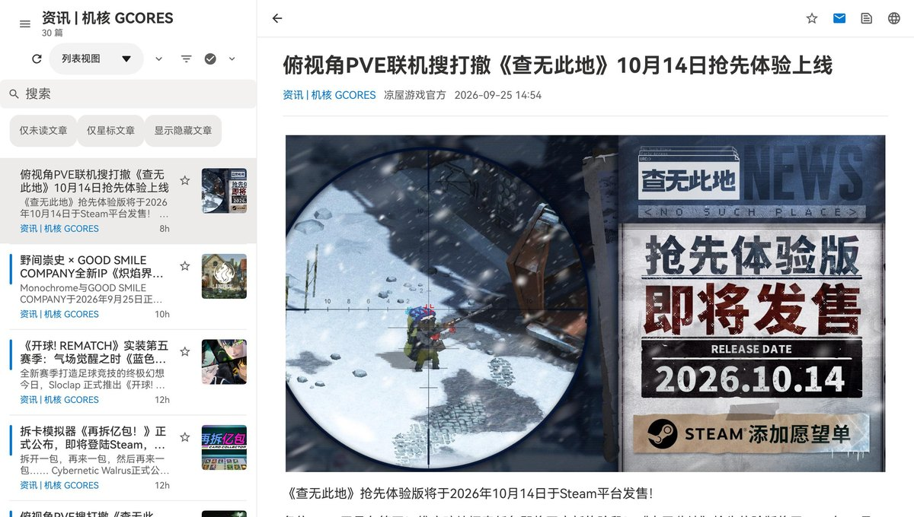
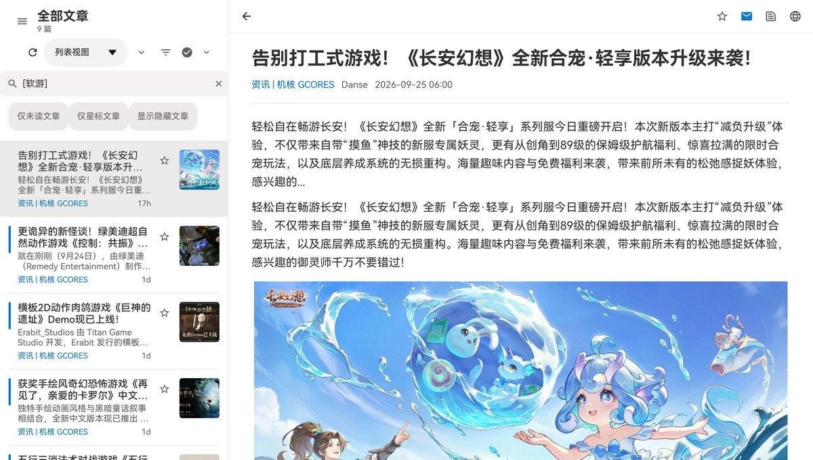
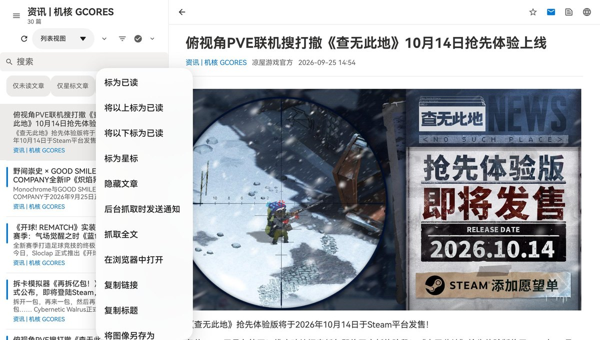
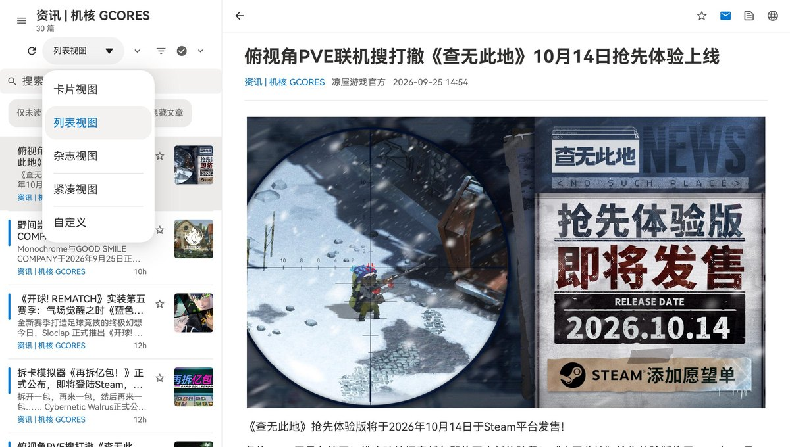
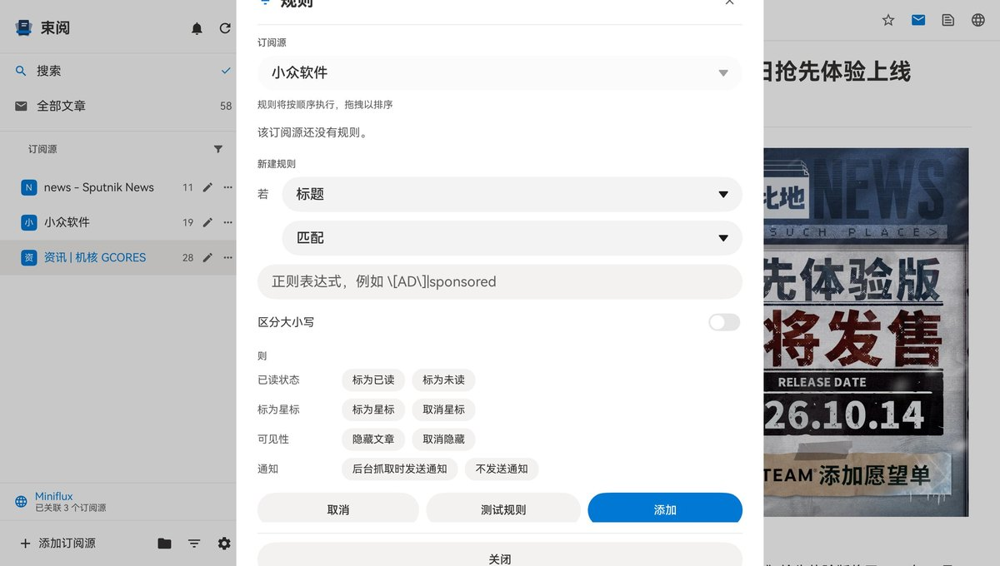
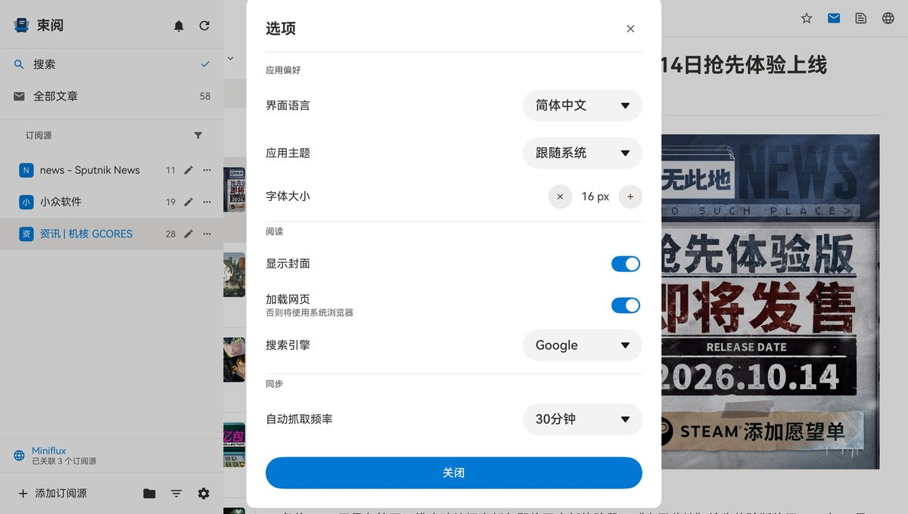
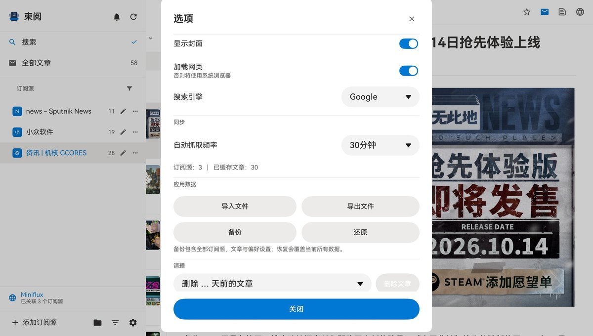
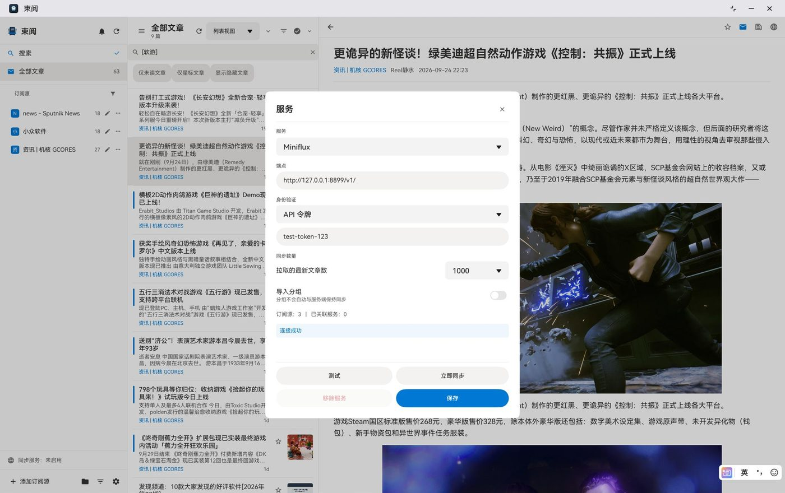

# Sheaf Reader 束阅

面向 **HarmonyOS NEXT（平板 / 2-in-1）** 的 RSS 阅读器，**由 AI 移植自 [Fluent Reader](https://github.com/yang991178/fluent-reader)**。

[](LICENSE)
[](#构建)
[](https://github.com/yang991178/fluent-reader)
[](#这是一个-ai-移植项目)

---

## 这是一个 AI 移植项目

- **上游项目**：[Fluent Reader](https://github.com/yang991178/fluent-reader) —— Electron + React + Redux + Fluent UI 的桌面 RSS 阅读器，
  作者 [yang991178](https://github.com/yang991178)（Haoyuan Liu），BSD-3-Clause。
- **本项目的全部代码、资源与文档都是 AI 生成的**：由 **DeepSeek** 在 **DeepSeek Harness（DSH）** 智能体框架下，
  按自然语言需求迭代产出，**没有人工逐行编写或重构**。人负责提需求、做范围取舍（删代理子系统、只留中英两种语言、
  仅适配平板与 2-in-1 等）、在模拟器上验收并报缺陷。
- **"移植"的含义**：功能语义、界面相对布局（结构 / 顺序 / 层级 / 操作位次）、数据模型与设置项语义**以上游为蓝本逐项对齐**；
  代码本身是用 ArkTS / ArkUI **重新实现**，不搬运上游 TypeScript 源码。
- **验证方式**：任何"已完成"都以设备取证为准（`hdc` 的 `dumpLayout` / 截图 / mock 服务端日志），
  另有 `verify/harness.ts` 的 **548 条**断言跑在**实际发布的源码**上。
- **许可**：BSD-3-Clause，保留上游版权声明；派生范围、改名记录与第三方组件见 [NOTICE](NOTICE)。
  本项目为个人非官方移植，与上游作者、与华为均无隶属或背书关系。

## 截图

> 由 `hdc` 在 HarmonyOS 模拟器（平板，API 13，2560×1600，应用全屏）上实时抓取，界面语言简体中文。
> 均为**真实订阅源**：作者自建 Miniflux 实例上的 3 个源（`news - Sputnik News` / `小众软件` / `资讯 | 机核 GCORES`），
> 文章、正文与封面图都是同步下来的真实内容；截图中不含端点、令牌等凭据。
> 「同步服务」一张是本地 mock 端点的**参数示意**（`测试` 返回「连接成功」），不涉及真实账号。

| 主界面 | 卡片视图 | 正则搜索 |
|---|---|---|
|  |  |  |
| 订阅源 + 列表 + 阅读器 | 5 种布局之一 | 标题正则 `[软游]` 命中 9 篇 |

| 文章菜单 | 视图菜单 | 规则引擎 |
|---|---|---|
|  |  |  |
| 右键 / 长按 | 布局与筛选 | 条件 + 8 个动作 |

| 设置 · 偏好 | 设置 · 数据与清理 | 同步服务 |
|---|---|---|
|  |  |  |
| 语言 / 主题 / 字号 | 备份还原 / 清理 | Miniflux（mock 端点示意） |

## 功能

- **同步**：Miniflux、Google Reader、Inoreader、Feedbin、Nextcloud News、Fever（六家均在模拟器上实机复核），
  也支持 `无（仅本地）`；已读 / 星标双向回写。
- **订阅**：订阅源自动发现、分组（新建 / 重命名 / 成员维护）、OPML 导入导出（任意深度嵌套）、源级设置。
- **列表**：全部 / 未读 / 星标预设 + 可组合筛选位（正则搜索、区分大小写、显示隐藏），5 种视图（列表 / 紧凑 / 杂志 / 卡片 / 自定义），每页 300 条。
- **阅读器**：正文按段落 / 内联图片 / `<video>` 分块渲染；「加载网页」「加载全文」是可逆的视图状态；选中文字用四种引擎搜索；字号可调。
- **规则**：源 + 标题/正文/作者 + 匹配与否 + 正则，8 个动作键，顺序执行，可试跑。
- **其它**：系统通知（含授权与点击穿透）、通知与抓取日志、`.frdata` 备份恢复、深色模式、抓取进度与频率上限、
  20 多个键盘快捷键、中英双语（`entry/src/main/resources/rawfile/i18n/*.json` + `utils/I18n.ets` 的内建表）。

## 构建

需要 **DevEco Studio 5.x+**（本项目在 DevEco Studio `6.0.0.878` + HarmonyOS SDK `API 20` 下验证）。
`compatibleSdkVersion` / `targetSdkVersion` = `5.0.0(12)`，`deviceTypes` = `tablet` + `2in1`（不含 `phone`）。

```bash
export DEVECO_SDK_HOME="/path/to/DevEco Studio/sdk"    # Windows: set / $env:
hvigorw --mode module -p product=default assembleHap --no-daemon
# 产物：entry/build/default/outputs/default/entry-default-unsigned.hap
```

装到设备需签名（DevEco 自动签名即可）；模拟器可直接安装未签名 HAP —— 本项目全部实机证据都是这样取得的。

## 验证

```powershell
pwsh -File verify/run.ps1      # 548 条断言，跑在实际发布的源码上
```

脚本把 `entry/src/main/ets` 下的发布源码转成 TS，在 Node 下断言解析、筛选与规则、i18n、抓取排程、通知深链、
正文分块、排版与热区等行为；找不到 TypeScript 时可用 `$env:VERIFY_TSC` 指定。
`verify/mock-miniflux.js` 是六种同步服务的本地 mock；`verify/miniflux-live.js` 可对真实 Miniflux 做只读探测
（地址与令牌只从环境变量读，不写进仓库）。

实机验收在 `Huawei_2in1`（2160×1440）与 `Huawei_Tablet`（2560×1600）两个模拟器镜像上完成，**真机尚未覆盖**。

## 已知限制

- **只有模拟器验收**：真机、横竖屏旋转、折叠屏 / 悬停态都没测过（模拟器无法触发旋转）；横竖屏的静态事实是
  `module.json5` 未声明 `orientation`，布局完全由窗口宽度驱动。
- **没有系统分享**：当前 SDK 无分享 API，只有「复制链接」。
- **代理 / PAC 已整体删除**（平台上没有可用落点），语言只保留中英，`deviceTypes` 不含手机 —— 均为按需求作出的刻意偏离。
- **正则搜索在内存求值**：`relationalStore` 不支持自定义 `REGEXP` 函数；**正文提取**是文本块打分的可读性抽取，不是上游打包的 mercury.js。
- **没有字体族选项**：上游的 `article.font` 依赖平台字体枚举（`getSystemFontList()` 仅在 2-in-1 生效），实测选择面很窄，已删除，正文固定用系统默认字体。
- **竖排文字不生效**（ArkUI 无竖排书写模式）；`F8` 无法用代码打开视图菜单。
- **"浏览器真的打开了"无法在本机证明**：模拟器镜像里没有浏览器，只能验到应用把正确的 URL 交给了 `startAbility`。

## 许可

**BSD 3-Clause**（与上游一致）：

```
Copyright (c) 2020, Haoyuan Liu (yang991178) — original Fluent Reader
Copyright (c) 2026, simon2137 — Sheaf Reader (束阅), HarmonyOS port
```

全文见 [LICENSE](LICENSE)，派生说明与第三方组件（图标为 Material Design Icons，Apache-2.0）见 [NOTICE](NOTICE)。
